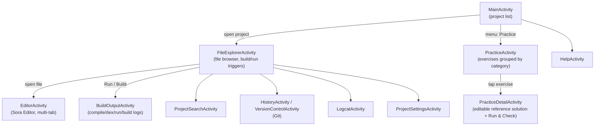
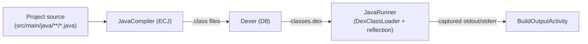
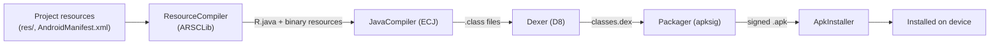
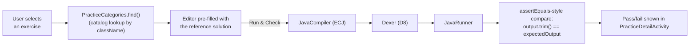
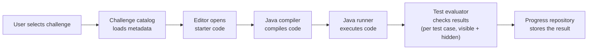

# Architecture

This document describes how Java IDE Mobile is put together today: the UI flow, the package
layout, and the compile/dex/run/build pipelines. For the practice/exercise system specifically
(what exists now vs. what's planned), see [`PRACTICE_ENGINE.md`](PRACTICE_ENGINE.md).

## Module layout

Single Gradle module: `:app` (see `settings.gradle.kts`). Everything — UI, compiler toolchain,
data layer — lives under `app/src/main/java/com/javaide/mobile/`.

## UI flow

`MainActivity` lists on-device projects (and offers a menu entry into the practice catalog,
independent of any project). Opening a project goes to `FileExplorerActivity`, the hub for that
project: browsing/editing files, triggering a compile+run or a full build, searching, viewing Git
history, and reading device logs.

## Compile → Run pipeline (Java Console projects)

- **`JavaCompiler`** (`compiler/JavaCompiler.kt`) invokes ECJ (`org.eclipse.jdt.internal.compiler.batch.Main`)
  in-process, targeting `-source 1.8 -target 1.8` against `android.jar` + any `libs/*.jar` on the
  classpath. Wrapped in `catch (Throwable)`: ECJ's `FileSystem` static initializer references
  `javax.lang.model.SourceVersion`, absent on Android, which throws `NoClassDefFoundError` (an
  `Error`, not `Exception`) without a stub.
- **`Dexer`** (`compiler/Dexer.kt`) runs D8, merging the project's `.class` files with any
  `libs/*.jar` and library-linking against `android.jar`. `minApiLevel` comes from the project's
  manifest (`ManifestUtils.readMinSdkVersion`) or `Dexer.DEFAULT_MIN_API_LEVEL = 26`.
- **`JavaRunner`** (`compiler/JavaRunner.kt`) loads `classes.dex` via `DexClassLoader`, finds the
  first class with `public static void main(String[])` (preferring one named `Main`), redirects
  `System.out`/`System.err` into a buffer, and invokes it. Runs **in-process, unsandboxed** — a
  hostile or infinite-looping snippet can hang or crash the host app.

## Compile → Build → Install pipeline (Android App projects)

`ResourceCompiler` generates `R.java` and compiled binary resources before the same
compile/dex steps as the console pipeline; `Packager` then signs the result with the app's
reused `DebugSigningKey` (via `apksig`), and `ApkInstaller` installs it.

Both pipelines are orchestrated by `FileExplorerActivity.runProject()` (console run) and
`runBuild()` (full Android build); each step captures logs, and a failure stops the pipeline and
shows results in `BuildOutputActivity`. All compile/dex/run/build work runs on `Dispatchers.IO`
via `lifecycleScope.launch`, with UI updates marshalled back via `Dispatchers.Main.immediate`.

## Practice flow

**Today**, the practice flow is a subset of the console pipeline, run against a reference solution
instead of project files — see [`PRACTICE_ENGINE.md`](PRACTICE_ENGINE.md) for the exact
`PracticeDetailActivity.execute()` implementation:

**Target shape** (per the interview-practice expansion plan — not yet implemented): the same
skeleton, generalized into a full challenge-execution engine with starter code separate from the
solution, multiple structured test cases (visible + hidden), and persistent progress:

This target diagram maps onto planned components: `ExerciseCatalog` (Milestone 3),
`ExerciseRunner` / `TestCaseRunner` / `ExerciseResultEvaluator` (Milestone 4), and
`PracticeProgressRepository` (Milestone 15). None of these exist yet in the codebase as of this
writing — see [`BASELINE.md`](BASELINE.md) for the current-state snapshot they build from.

## Key packages

| Package | Purpose |
|---|---|
| `com.javaide.mobile.compiler` | Full toolchain: `JavaCompiler`, `Dexer`, `JavaRunner`, `ResourceCompiler`, `Packager`, `ApkInstaller`, `AndroidJarProvider`, `DebugSigningKey`, `ManifestUtils`, `LibJars`, plus the current practice catalog (`InterviewExercises`, `PracticeCategories`) |
| `com.javaide.mobile.ui` | Activities and RecyclerView adapters (see UI flow above) |
| `com.javaide.mobile.model` | `ProjectTemplate` — scaffolds Android App / Java Console projects |
| `com.javaide.mobile.util` | `ProjectStorage`, `FileOps`, `PackageRenamer`, `ClassRenamer`, `LogcatReader`, `ProjectSearch` |
| `com.javaide.mobile.completion` | `SemanticCompletionEngine`, `DiagnosticsEngine`, `ImportIndex`, `ImportInserter`, `DefinitionFinder` |
| `com.javaide.mobile.data` | Room database: `AppDatabase`, `AppDao`, `EditorState`, `EventEntry`, `Logger` |
| `com.javaide.mobile.vcs` | `GitRepository`, `GitCommitSigner`, `PgpKeyManager` |

## Data layer

Room (`com.javaide.mobile.data.AppDatabase`) currently persists:

- `EditorState` — cursor line/column per file path, restored on next open
- `EventEntry` — an activity/event log, also mirrored to a rotating on-device file
  (`filesDir/logs/activity.log`, via `Logger`)

There is no persistence yet for practice progress (attempts, solved state, hints used, etc.) —
see the Progress Tracking milestone in the expansion plan.

## Key conventions

- **Project storage layout:** `context.filesDir/projects/<ProjectName>/src/main/java|res/`, build
  artifacts in `build/classes/`, `build/dex/`, `build/generated/r/`, `build/outputs/`.
- **Third-party JARs:** auto-discovered from `libs/*.jar` in the project root; `LibJars` passes
  them to both the ECJ compile classpath and the D8 merge step.
- **`android.jar`** is bundled in assets and extracted on first run by `AndroidJarProvider`; the
  Gradle `copyAndroidJar` task populates it from `bootClasspath` at build time — it is not
  committed to the repo as a binary.
- **Editor debouncing:** auto-save and diagnostics both trigger 1.5s after the last keystroke.
  `EditorActivity` reuses a single Sora `CodeEditor` instance across tabs (undo history resets on
  tab switch; auto-save protects file content from that reset).
